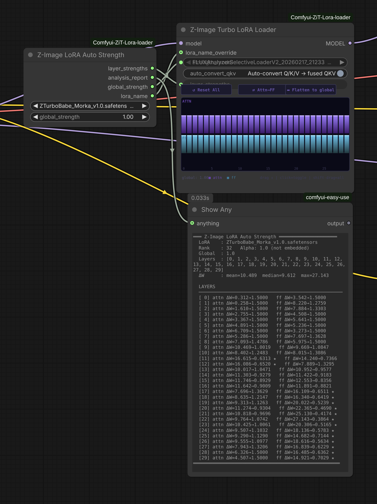

# ComfyUI Z-Image Turbo LoRA Loader
[](https://buymeacoffee.com/capitan01r)
[](LICENSE)

Architecture-aware LoRA loading for **Z-Image Turbo** (Lumina2) in ComfyUI, with automatic per-layer strength calibration based on forensic weight analysis.



## Background

LoRAs trained against Z-Image Turbo are commonly shipped with separate `to_q`, `to_k`, `to_v` projections — the standard diffusers export format. Z-Image Turbo's native architecture stores attention as a single fused QKV matrix. Loading these LoRAs without conversion means the attention weights never reach the model.

| What the LoRA ships with | What Z-Image Turbo expects | What this pack does |
|---|---|---|
| Separate `to_q` / `to_k` / `to_v` | Fused `attention.qkv` `[11520, 3840]` | Block-diagonal fusion at load time |
| `to_out.0` naming | `attention.out` naming | Remaps automatically |
| Any prefix convention | Lumina2 exact key mapping | Uses `z_image_to_diffusers()` |
| Global strength only | Per-layer control | Interactive graph widget + auto-calibration |

## Installation

```bash
cd ComfyUI/custom_nodes
git clone https://github.com/capitan01R/Comfyui-ZiT-Lora-loader.git
```

## Nodes

### Z-Image Turbo LoRA Loader

| Input | Type | Description |
|---|---|---|
| `model` | MODEL | Z-Image Turbo / Lumina2 model |
| `lora_name` | dropdown | LoRA file from `models/loras` |
| `strength_model` | float | Global LoRA strength (-20.0 to 20.0) |
| `auto_convert_qkv` | boolean | Fuse separate Q/K/V to Z-Image's native fused QKV format |
| `lora_name_override` | string (link) | Optional — overrides the dropdown when connected |
| `layer_strengths` | string (link) | Optional — per-layer JSON from Auto Strength node |

The graph widget shows 30 columns, one per transformer layer, each split between attention (purple, top) and feed-forward (teal, bottom). Drag to adjust. Shift-drag moves all active layers together. Click to toggle.

### Z-Image Turbo LoRA Stack
Apply up to 10 LoRAs in sequence with independent strength, enable toggle, and QKV fusion per slot.

### Z-Image LoRA Auto Strength
Reads the LoRA's weight tensors directly and computes per-layer strengths from the actual training signal in the file. One knob: `global_strength`.

### Z-Image LoRA Auto Loader
Self-contained version of the above — analysis and application in one node. `model` in, patched `model` out.

## How Auto Strength works

For every layer pair in the file:

```
ΔW = lora_B @ lora_A
scaled_norm = frobenius_norm(ΔW) * (alpha / rank)
strength = clamp(global * (mean_norm / layer_norm), floor=0.30, ceiling=1.50)
```

High-signal layers get pulled back, low-signal layers get nudged up, mean lands at `global_strength`. Layer discovery is fully dynamic.

## Z-Image Turbo Architecture Reference

```
30 transformer layers
  attention
    qkv.weight      [11520, 3840]  (fused Q+K+V)
    out.weight       [3840, 3840]
    q_norm.weight    [128]
    k_norm.weight    [128]
  feed_forward
    w1.weight        [10240, 3840]  (SwiGLU)
    w2.weight        [3840, 10240]
    w3.weight        [10240, 3840]
  attention_norm.weight    [3840]
  ffn_norm.weight          [3840]
  modulation.linear.weight [15360, 3840]  (AdaLN)

dim=3840  n_heads=30  n_kv_heads=30  head_dim=128
```
